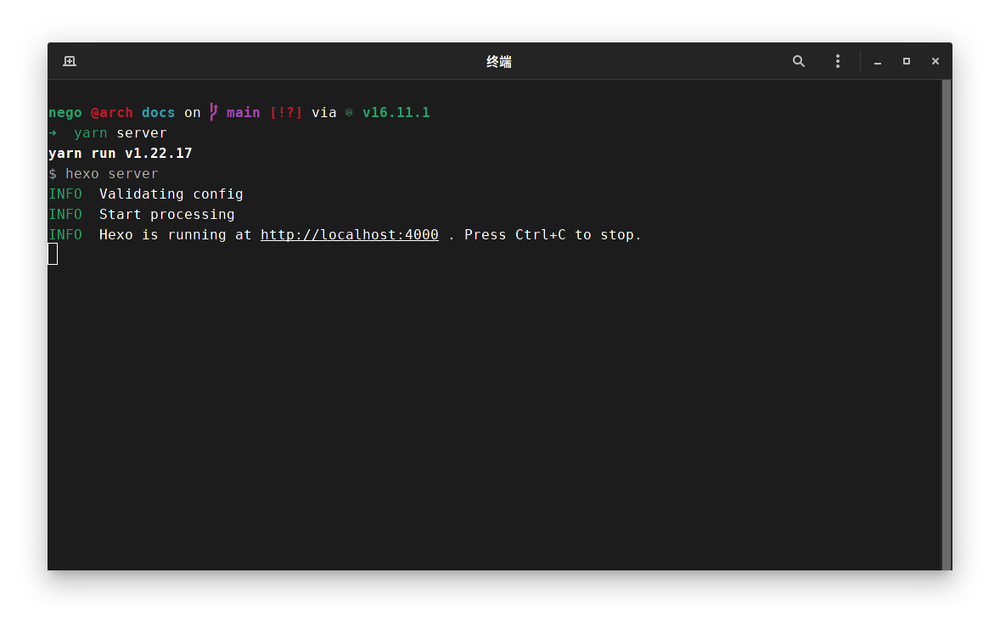


为了能够顺利的参与编写文档，你应当掌握以下知识：
- Markdown 语法
- Git 指令的使用
- Hexo 的目录结构(可选，本文章将会简要概述)
- Node.JS 及其相关指令的用法(可选，用于本地预览本文档)


## 摘要

编辑本文档的大概步骤为：  
`克隆仓库` -> `安装本地预览环境(可选)` -> `添加并编写文章` -> `保存并提交` -> `推送到远程`

如果你已经在电脑上编辑过，当前为二次编辑，你的步骤可以简化为：  
`添加并编写文章` -> `保存并提交` -> `推送到远程`

## 克隆仓库

目的是将仓库克隆到本地，你也可以理解为下载，你得下载了文件才能编辑文件。

克隆仓库需要使用 Git 指令：

```bash
cd ~/workspace # 切换到你需要使用目录，也就是保存的目录
# 克隆
# https 方式
git clone https://github.com/negoces/docs
# ssh 方式
git clone git@github.com:negoces/docs.git
# 如果你的网络环境(指连接外网)并不是很好，请使用下列镜像
git clone https://hub.fastgit.org/negoces/docs
git clone git@ssh.fastgit.org:negoces/docs.git
```


建议使用 SSH 方式克隆仓库，如果你只是想克隆该仓库而不推送仓库，两种方式都可以使用，但我们编写文档一定要用到推送，当你使用 https 时你每次推送都需要输入用户名密码，而 ssh 不需要，并且使用 https 推送时不能使用镜像。



使用 SSH 方式需要在当前电脑生成 SSH 密钥并添加到 Github 设置。  
使用 `ssh-keygen` 指令生成 SSH 密钥对并将 `~/.ssh/id_rsa.pub` 里面的内容(SSH 公钥)添加到 Github。  
操作方式：点击头像 -> `Settings` -> `SSH and GPG keys` -> `New SSH keys`，Title 任意，用于自己辨识，Key 填写公钥。

- 使用 `ssh-keygen -t ed25519` 指令可以生成 ed25519 密钥对，这样密钥更短，公钥将被保存到 `~/.ssh/id_ed25519.pub` 文件。


## 安装本地预览环境(可选)

用于在编写时在本地预览

1. 安装 Node.JS 环境，Arch Linux 可以参考 <https://new.negoces.top/posts/c387f9ce/> 安装，Windows 用户可到 <https://nodejs.org/zh-cn/> 下载安装。
2. 使用 `npm set registry http://repo.nju.edu.cn/repository/npm/` 指令设置镜像加速软件安装。
3. 在仓库目录下使用 `npm i` 或 `yarn`(需自己安装) 指令安装所需依赖。
4. 使用 `npm run server` 或 `yarn server` 指令启动预览服务。
5. 浏览 <http://localhost:4000> 即可实时预览文档内容。



## 添加并编写文章

文档的文章存放在 `sources` 文件夹，为 Markdown 格式文件。


创建或添加文章时请注意路径规范，要凸显其分类，比如当前文档为编写文档的教程，故分类在：

- `sources/docs/others/writting/index.md`

STM32 的 GPIO 教程则分类在(包含图片存放路径)：

- `sources/docs/stm32/GPIO/index.md`
- `sources/docs/stm32/GPIO/1.png`
- `sources/docs/stm32/GPIO/2.png`
- `sources/docs/stm32/GPIO/3.jpg`

目录需自行手动添加，文档不会自动生成目录。


文章头部需添加下列参数：

```yaml
---
title: 标题
description: 描述
type: docs # 类型
author_info: 由 xxx 编写 # 作者信息(可选)
last_updated: 2021-11-19 # 最后编辑日期(可选)
---
```

目录则保存在 `_config.doku.yml` 文件的 `sidebar.zh-CN.docs.items` 数组内，格式如下：

```yaml
items:
  - STM32:
    - 1.开发环境搭建 | docs/stm32/setup_devenv/
    - 2.GPIO使用 | docs/stm32/GPIO/
  - 其他:
    - 编写文档 | docs/others/writting/
    - 额外语法 | docs/others/shortcut/
```


其中 `|` 符号前的为文章在目录内显示的标题，后面的为文章相对于 `sources` 文件夹的相对路径。

相对路径最后注意不要遗漏 `/`，否则会导致图片无法加载。这与 Hexo 的渲染有关，举 `GPIO使用` 这篇文章为例子，Hexo最终会生成下列文件：

- `/docs/stm32/GPIO/index.html`
- `/docs/stm32/GPIO/1.png`

在使用 `docs/stm32/GPIO` 路径时，`/docs/stm32/GPIO/index.html` 被正常加载，但是文章会尝试寻找 `/docs/stm32/1.png` 路径的图片，这显然会导致 404，在使用 `docs/stm32/GPIO/` 路径时，文章会尝试寻找 `/docs/stm32/GPIO/1.png` 路径的图片，图片被正常加载。


## 保存并提交

1. 使用 `git add *` 指令将所有更改暂存在本地。
2. 使用 `git commit -m "提交信息"` 添加提交信息。

## 推送到远程

使用 `git push` 将本地的提交推送到远程(即 Github)。


当你推送失败时请不要轻易使用 `-f` 或 `--force` 强制推送参数，这通常是由于本地提交记录和远程记录不一样致导致的。使用强制推送会导致其他人编写的文章丢失，此时你应该使用 `get fetch` 获取远程更改并使用 `git rebase` 或 `git merge` 指令进行 `变基` 或 `合并` 操作以解决该问题。具体用法请自行查阅百度或 bilibili。

