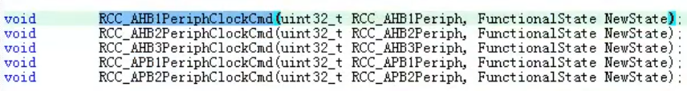
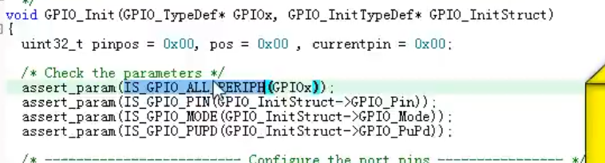
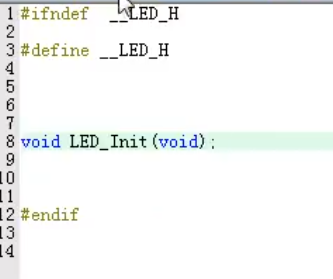

## 基础知识

**时钟使能函数:**



### 四个重要函数

**1.初始化函数:**  
**作用：初始化一个或多个 IO 口(同一组)的工作模式，输出类型，速度及上下拉方式。也就是一组 IO 口的 4 个配置寄存器**

```C
void GPIO_init(GPIO_TypeDef*GPIOx,GPIO_initTypeDef*GPIO_InitStruct)
```

**结构体说明:**

```C
typedef struct{
unit32_t GPIO_Pin;//指定要初始化的端口
//初始化GPIO时若为同一组且一下状态相同可用(GPIO_init GPIOx|GPIOx)
GPIOMode_Typedef GPIO_Speed;//速度
GPIOOType_Typedef GPIO_OType;//输出类型
GPIOPuPd_TypeDef GPio_PuPd;//上拉下拉
}GPIO_InitTypeDef;
```



```C
assert*param//(检测输入是否合法的函数)
```

\*两个读取输入电平函数.

```C
unit8_t GPIO_ReadinputDataBit(GPIO_TypeDef*GPIOx,unit16_tGPIO_Pin)
//作用：读取某个GPIO的输入电平
unit16_t GPIO_ReadinputData(GPIO_TypeDef*GPIOx)
//作用：读取某组GPIO的输入电平
```

**两个读取输出电平函数:**

```C
unit8_t GPIO_ReadOutputDataBit(GPIO_TypeDef* GPIOx,unit16_t GPIO_Pin);
//作用：读取某个GPIO的输入电平
（实际上操作的是GPIO_ODR寄存器）
unit16_t GPIO_ReadPutputData(GPIO_TypeDef*GPIOx)
//作用：读取某组GPIO的输出电平。
（实际操作的是GPIO_ODR寄存器）
```

四个设置输出电平函数.

```C
*void GPIO_SetBits(GPIO_TypeDef*GPIOx,unit16_t GPIO_Pin);
//作用：设置某个IO口输出为高电平（1）
（实际操作做BSRRL寄存器）
*void GPIO_ReseBits(GPIO_TypeDef*GPIOx,unit16_t GPIO_Pin);
//作用：设置某个IO口输出为低电平
void GPIO_WrieBit(GPIO_TypeDef*GPIOx,unit16_t GPIO_Pin,BitAction BitVal);
void GPIO_Write(GPIO_TypeDef*GPIOx,unit16_t PortVal);
（上面这两个函数不常用）
```

### 点亮 LED 步骤

1、使能 IO 口时钟，调用 RCC_AHB1PeriphClockCmd();  
**不同外设调用的时钟函数可能不一样**  
2、初始化 IO 口模式。调用函数 GPIO_Init();
3、操作 IO 口，输出高低电平  
GPIO_SeBit()  
GPIO_ResetBits()

#### **.h 文件书写方式**

```C
#ifndef xxx.h

#define xxx.h

#endif
//作用：在多文件编写的时候对于头文件的定义需要检查是否有重复，以该方式定义，可以避免头文件的重复定义
```

包含的头文件{
stm32f4x.h  
 led.h  
   
 delay.h  
}

### **最终代码呈现**

```C
#include 'stm32f4xx.h'
#include 'led.h'
#include 'delay.h'

int main(){
    delay_0init();
    LED_Init();

    while(1){
        GPIO_SetBits(GPIOF,GPIO_Pin_x1);
        GPIO_SetBits(GPIOF,GPIO_Pin_x2);
    delay_ms(500);

    GPIO_ResetBits(GPIOF,GPIO_Pin_x1);
    GPIO_ResetBits(GPIOF,GPIO_Pin_x2);
    delay_ms(500);
    }
}
```
