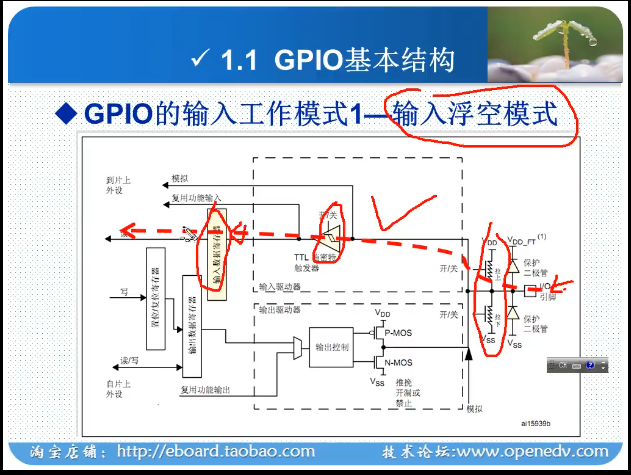
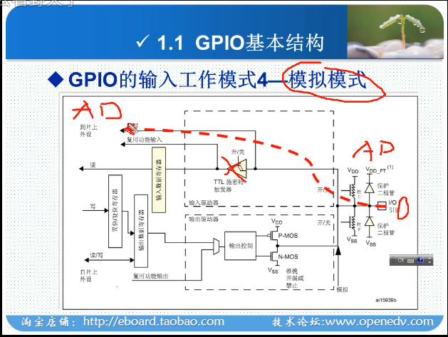
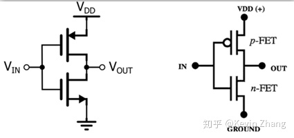

# GPIO 引脚说明

## **GPIO 功能**

GPIO 可用做输入输出  
也可用做外设

## 八种工作模式

### **浮空模式**

浮空模式：浮空电路不工作  
下半部分电路不工作  
上半部分正常工作

### $\color{azure}{输入上拉模式}$

保证在没有输入的情况下引脚保持高电平

### $\color{azure}{输入下拉模式}$

参考上拉

### **模拟输入**

**A/D 转换**

### $\color{azure}{推挽输出}$

由两个 MOS 或者三极管收到互补控制的信号控制，两个管子时钟一个在导通，一个在截止  
  
**特点**
可以真正能真正的输出高电平和低电平，在两种电平下都具有 [驱动能力]

> [驱动能力]: 所谓的驱动能力，就是指输出电流的能力。对于驱动大负载（即负载内阻越小，负载越大）时，例如 IO 输出为 5V，驱动的负载内阻为 10ohm，于是根据欧姆定律可以正常情况下负载上的电流为 0.5A（推算出功率为 2.5W）。显然一般的 IO 不可能有这么大的驱动能力，也就是没有办法输出这么大的电流。于是造成的结果就是输出电压会被拉下来，达不到标称的 5V。当然如果只是数字信号的传递，下一级的输入阻抗理论上最好是高阻，也就是只需要传电压，基本没有电流，也就没有功率，于是就不需要很大的驱动能力。

$\color{azure}{缺点：}$  
如果当两个推挽输出结构相连在一起，一个输出高电平，即上面的 MOS 导通，下面的 MOS 闭合时；同时另一个输出低电平，即上面的 MOS 闭合，下面的 MOS 导通时。电流会从第一个引脚的 VCC 通过上端 MOS 再经过第二个引脚的下端 MOS 直接流向 GND。整个通路上电阻很小，会发生短路，进而可能造成端口的损害。这也是为什么推挽输出不能实现" 线与"的原因。

[我是链接](https://www.zhihu.com/question/28512432)

<https://www.zhihu.com/question/28512432>
