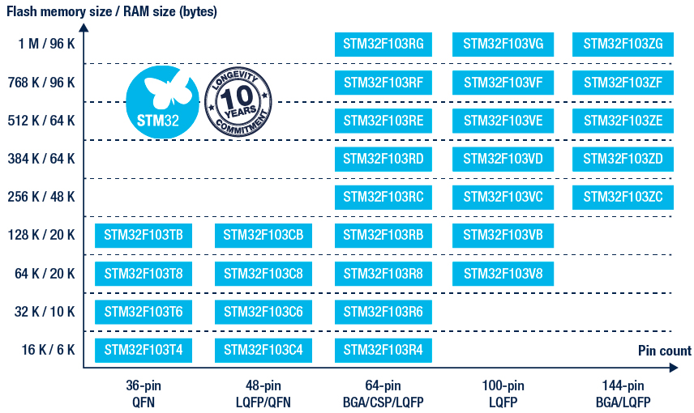

## STM32 介绍

官方介绍：<https://www.st.com/zh/microcontrollers-microprocessors/stm32-32-bit-arm-cortex-mcus.html>

> STM32 系列 32 位微控制器基于 Arm® Cortex®-M 处理器，旨在为 MCU 用户提供新的开发自由度。它包括一系列产品，集高性能、实时功能、数字信号处理、低功耗/低电压操作、连接性等特性于一身，同时还保持了集成度高和易于开发的特点。
>
> 优势尽显且品种齐全的 STM32 微控制器基于行业标准内核，提供了大量工具和软件选项以支持项目开发，使该系列产品成为小型项目或端到端平台的理想选择。

ST 官方将 STM32 控制器分为 4 大类 17 个系列。具体如下：

| 分类               | 系列                                                                                 |
| :----------------- | :----------------------------------------------------------------------------------- |
| STM32 主流 MCU     | STM32F0 系列、STM32F1 系列、STM32F3 系列、STM32G0 系列、STM32G4 系列                 |
| STM32 无线 MCU     | STM32WB 系列、 STM32WL 系列                                                          |
| STM32 超低功耗 MCU | STM32L0 系列、 STM32L1 系列、STM32L4 系列、STM32L4+ 系列、STM32L5 系列、STM32U5 系列 |
| STM32 高性能 MCU   | STM32F2 系列、STM32F4 系列、STM32F7 系列、STM32H7 系列                               |

## STM32 的构成

STM32 包含核心、时钟、总线、GPIO 等组件(其余的在后续教程中举例并解释)。

- 核心：你可以理解为大脑，控制着整个芯片的所有主动事务。
- 电源：你可以理解为心脏，为整个芯片的所有组件供电。
- 时钟：你可以理解为小脑，为芯片提供稳定的频率来源。
- 总线：你可以理解为神经，连接核心与各个组件。
- GPIO 等其他设备：你可以理解为手脚等由核心控制能输出、接收信号的组件。

## 如何选择学习用板

**一般入门学习都会使用 STM32F103 系列，进阶学习使用 STM32F407 系列。**

> STM32F103 微控制器采用 Cortex-M3 内核，CPU 最高速度达 72 MHz。该产品系列具有 16KB ~ 1MB Flash、多种控制外设、USB 全速接口和 CAN。

一般教程都会推荐 STM32F103C8T6 作为学习板，然而也正是因为他的广泛且便宜，某宝上有不少廉价的盗版芯片，造成了在学习及开发的过程中出现一堆疑难杂症，比如 CPUID 不一样导致需要在 OpenOCD 脚本中添加 `set _CPUTAPID 0x........` 才能正常调试。在我看来不如直接加点钱购买 **STM32F103ZET6**，RAM 比 STM32F103C8T6 大，IO 多。

**选择核心板还是精英板：**

- 核心板：除维持 STM32 芯片运行的必要元件及 IO 引出外，电路板上不包含其他任何多余部件及外设。
- 精英板：除核心板所拥有的组件外，电路板上搭载了一些供学习使用的外设，如 LED，继电器，温度传感器等，当然这可能导致精英板可用的 IO 比核心板少。

你可以根据自己的需求选择开发板，但是，**无论你选择的是核心板还是开发板，请找客服索要开发板的原理图(电路图)** ，否则你可能连最简单的 LED 都无法点亮。

**调试器的选择：**

目前主流的调试器有 J-Link 和官方的 STLINK，就调试的方便程度来说，建议选择 STLINK，而且建议选择某宝盗版的 STLINKv2 mini，正版的 STLINK 在调试时，开发板仍需要电源辅助供电，盗版的则不需要，还比正版便宜不少。

## 开发模式的选择

STM32 的开发一般都是 C 语言，但要使 STM32 动起来可以使用 **寄存器操作**、**ARM CMSIS 标准库**、**STM32 HAL 库函数** 三种操作方式。其中 **寄存器操作** 比较底层，直接通过逻辑与、逻辑或、异或、移位等操作直接修改寄存器，可以更好的理解 STM32 底层机制，**STM32 HAL 库函数** 为 ST 公司为自家的硬件封装的统一函数库，实现了同一函数能在不同硬件上使用相同的功能，可以几乎不修改代码将程序移植到其他系列。

本文档作为入门文档，推荐先使用 **寄存器操作** 进行开发，待理解、熟练操作该部分后换为 **STM32 HAL 库函数** 对该部分进行开发，其他部分依然通过先 **寄存器操作** 后 **STM32 HAL 库函数** 的方式进行学习。
