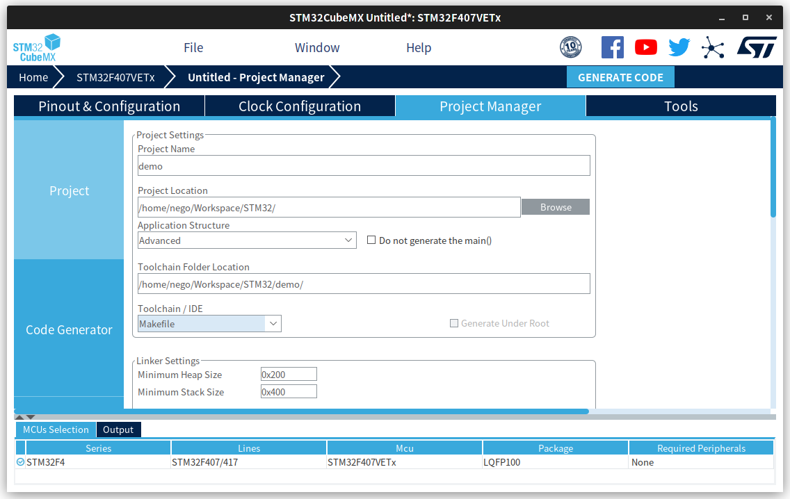
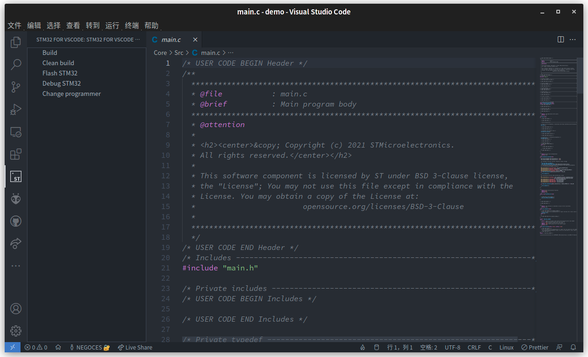

STM32 可以使用众多 IDE 开发，如：[Keil MDK](https://www.arm.com/products/development-tools/embedded-and-software/keil-mdk)、[STM32 CubeIDE](https://www.st.com/zh/development-tools/stm32cubeide.html)、[JetBrains CLion](https://www.jetbrains.com/clion/)

在以上 IDE 当中，个人推荐使用 JetBrains CLion，但是它收费(这个好说，网上一堆补丁)且基于 Java 有些许笨重，再加上我本人是 Visual Studio Code 党，这里介绍了如何使用 Visual Studio Code 对 STM32 进行开发。

使用 Visual Studio Code 对 STM32 进行开发具有以下特点：

- IDE 轻量，启动速度快，不占资源
- 相对于 Keil 具有代码高亮、代码补全、报错显眼等特点


以下文章基于 Arch Linux 进行编写，Windows 环境下安装相应的软件稍作配置也可使用。软件列表：

- [STM32 CubeMX](https://www.st.com/en/development-tools/stm32cubemx.html)
- [GNU Arm Embedded Toolchain](https://developer.arm.com/open-source/gnu-toolchain/gnu-rm/downloads)
- GNU Make
- OpenOCD


## 下载安装 VS Code

使用 `yay` 工具进行安装(yay 需额外安装，archlinuxcn源内包含 yay 包)

```bash
yay -S visual-studio-code-bin
```


前往 <https://code.visualstudio.com/> 下载对应平台的软件包，如果下载速度过慢，可将下载链接中的域名 `az764295.vo.msecnd.net` 替换为 `vscode.cdn.azure.cn` 加速下载。


## 安装编译调试工具

```
sudo pacman -S \
arm-none-eabi-gcc \
arm-none-eabi-gdb \
gdb make stlink openocd
```

Windows 用户请自行下载相应软件并安装。

## 安装 VS Code 扩展

安装 stm32-for-vscode 和 Cortex-Debug

`Ctrt` + `P` 键打开命令框，依次执行下列安装指令：

```bash
ext install bmd.stm32-for-vscode
ext install marus25.cortex-debug
```

## 下载 CubeMX 并创建项目

前往 <https://www.st.com/en/development-tools/stm32cubemx.html> 下载 STM32 CubeMX 并安装运行。

创建项目时 Toolchain / IDE 选择 `Makefile`



## 使用 VS Code 打开项目

当使用 VS Code 打开 STM32 项目文件夹时，边栏会自动出现 STM32 扩展图标，点击进入后可进行编译、烧录、调试等操作。(VS Code 会自动检测已连接的 stlink/jlink 和 STM32 开发板)


